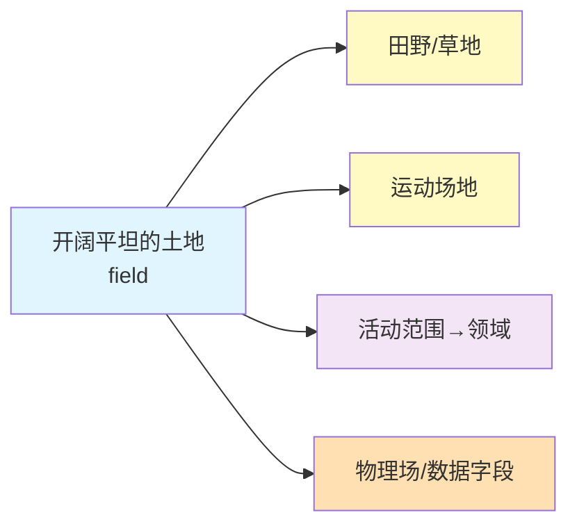

# field

## 基本信息

- **发音**: /fiːld/
- **词性**: 名词、动词
- **频率**: ⭐⭐⭐⭐⭐ (极高频)
- **来源**: 古英语 *feld* (开阔地、平地)

---

## 核心含义

> [!important] 多义词提醒
> **field** 是一个典型的**多义词**，核心概念是"开阔的空间/场地"，在不同语境下有不同含义：
> - 具体意义：田野、运动场地
> - 抽象意义：学术领域、活动范围
> - 专门意义：物理场、数据字段

### noun - **多种含义**

#### 1️⃣ 田野、开阔地、场地

> [!info] 最原始、最具体的意义

- a wheat **field** - 麦田
- a football **field** - 足球场
- oil/gas **field** - 油田/气田
- rice **fields** - 稻田

**例句**：
- The children ran across the grassy **field**.
  （孩子们跑过草地。）
- Cows were grazing in the **field**.
  （牛在田野里吃草。）

#### 2️⃣ 领域、范围、专业

> [!abstract] 抽象意义，指知识或活动范围

- **field of study** - 研究领域
- **field of medicine/science** - 医学/科学领域
- **expert in one's field** - 某领域的专家

**例句**：
- She is a leading expert in the **field** of artificial intelligence.
  （她是人工智能领域的领军专家。）
- This paper covers a wide **field** of research.
  （这篇论文涵盖了广泛的研究领域。）

#### 3️⃣ 实地、野外 (现场)

> [!tip] 相对于实验室/理论

- **field work** - 实地工作/野外工作
- **field research** - 实地研究
- **field trip** - 实地考察
- **in the field** - 在实地/在现场

**例句**：
- The students went on a **field** trip to the museum.
  （学生们去博物馆实地考察。）
- Anthropologists often spend years doing **field** work.
  （人类学家经常花数年时间进行实地工作。）

#### 4️⃣ (物理)场

> [!warning] 物理学概念

- **magnetic field** - 磁场
- **electric field** - 电场
- **gravitational field** - 引力场
- **electromagnetic field** - 电磁场

**例句**：
- The Earth's magnetic **field** protects us from harmful radiation.
  （地球磁场保护我们免受有害辐射。）

#### 5️⃣ (计算机)字段

> [!example] 数据库或表单中的数据项

- **data field** - 数据字段
- **input field** - 输入字段
- **required field** - 必填字段
- **fill in the field** - 填写字段

**例句**：
- Please fill in all the required **fields** in the form.
  （请填写表格中所有必填字段。）

### verb - **接(球)、应对、处理**

#### 1. 接(球)、守(场)
- **field a ball** - 接球
- **field a team** - 组队参赛

#### 2. 应对、处理 (问题、电话等)
- **field questions** - 回答问题
- **field complaints** - 处理投诉

**例句**：
- The reporter had to **field** tough questions from the audience.
  （记者不得不应对观众提出的尖锐问题。）

---

## 🔬 词源分析

### 构词结构

```
field = 古英语 feld (开阔地、平地)
      ↓
    原始印欧语词根 *pel- (平坦、开阔)
```

### 词源演变路径

```
原始印欧语: *pel- (平坦、开阔)
    ↓
古日耳曼语: *felthuz
    ↓
古英语: feld (开阔地、平地)
    ↓
中古英语: field
    ↓
现代英语: field (田野→场地→领域→场)
```

### 语义延伸逻辑



**核心隐喻**：
```
开阔的空间 → 可以活动的范围 → 知识/活动的领域
                ↓
           特殊用途的"场地" (运动、物理、数据)
```

> [!info] 同源词
> - 德语: **Feld** (田野)
> - 荷兰语: **veld** (开阔地、草原)
> - 这些词都来自同一个原始印欧语词根 *pel-

---

## 💡 记忆技巧

### 方法1: 核心概念延伸法

```
第一步：记住最基本的意思
field = 田野、开阔地

第二步：理解隐喻延伸
开阔地 → 活动空间 → 知识/活动领域

第三步：掌握特殊用法
运动场地、物理场、数据字段
```

### 方法2: 场景联想法

```
场景1：看到农民在田地里干活
→ 联想：field = 田野

场景2：看到足球比赛
→ 联想：field = 足球场

场景3：听到"学术领域"
→ 联想：field = 领域

场景4：物理课讲"磁场"
→ 联想：field = 场

场景5：填表单看到"必填字段"
→ 联想：field = 字段
```

### 方法3: 对比记忆法

| 语境 | 用词 | 侧重点 |
|:-----|------|--------|
| 农业 | field | 土地、生产 |
| 体育 | field/pitch/court | 不同运动用不同词 |
| 学术 | field/domain/realm | 知识范围 |
| 物理 | field | 力的作用空间 |
| 计算机 | field/column | 数据项 |

---

## 📚 常用搭配

### 名词搭配

| 搭配 | 含义 | 例句 |
|:-----|------|------|
| **field of study** | 研究领域 | Physics is his main field of study. |
| **field work** | 实地工作 | She's doing field work in the Amazon. |
| **field trip** | 实地考察 | Our class went on a field trip. |
| **field research** | 实地研究 | They conducted field research in Africa. |
| **magnetic field** | 磁场 | The magnetic field is strong here. |
| **electric field** | 电场 | The electric field around the conductor. |
| **level playing field** | 公平竞争环境 | We need a level playing field. |
| **in the field** | 在实地/在现场 | They are conducting research in the field. |

### 动词搭配

| 搭配 | 含义 | 例句 |
|:-----|------|------|
| **field questions** | 回答问题 | She had to field questions from reporters. |
| **field complaints** | 处理投诉 | He fields customer complaints all day. |
| **field a team** | 组队参赛 | They fielded a strong team. |

### 习语表达

| 习语 | 含义 | 例句 |
|:-----|------|------|
| **a level playing field** | 公平竞争环境 | We need to create a level playing field. |
| **out in left field** | 离谱/不合常理 | Your idea is way out in left field. |
| **play the field** | 感情不专一 | He's not ready to settle down; he's playing the field. |
| **hold the field** | 保持领先/未被取代 | This theory has held the field for decades. |
| **leave the field clear** | 为某人扫清障碍 | His resignation left the field clear for his rival. |

---

## ⚠️ 常见误解辨析

### 误解1: field 只表示"田野"

**错误认识** ❌
```
field = 田野、土地
```

**正确理解** ✅
```
field 是一个高度多义的词，核心概念是"开阔的空间/场地"
在不同领域有不同的专业含义：
- 学术领域
- 物理场
- 数据字段
- 实地工作
```

### 误解2: field = domain (完全等同)

**对比辨析**：
| 单词 | 侧重点 | 使用场景 |
|:-----|--------|----------|
| **field** | 活动领域，范围更广 | 学术、专业、日常 |
| **domain** | 知识/权力范围，更正式 | 学术、技术、正式场合 |
| **area** | 区域、领域，最通用 | 任何场合 |

### 误解3: 体育场地都用 field

**实际情况**：
- **football field** (美式足球) / **football pitch** (英式足球)
- **tennis court** (网球场)
- **basketball court** (篮球场)
- **baseball field** (棒球场)

> [!tip] 记忆窍门
> - **field**: 大型开放式场地（足球、棒球、田径）
> - **court**: 有边界的场地（网球、篮球、羽毛球）
> - **pitch**: 英式英语常用（足球、橄榄球、板球）

---

## 📝 学习笔记

### 复习要点
- [ ] 核心概念：field = 开阔的空间/场地
- [ ] 五大含义：田野、领域、实地、物理场、数据字段
- [ ] 词源：古英语 feld，原始印欧语 *pel-
- [ ] 常用搭配：field of study, field work, magnetic field
- [ ] 习语：level playing field, out in left field

### 常见错误提醒
- [ ] ❌ 不要只记住"田野"这一个意思
- [ ] ❌ 不要混淆 field/pitch/court 的使用场景
- [ ] ✅ 记住：field 是根据语境变化的动态多义词

### 语境练习
```
语境1：农民在________里种庄稼
→ field (田野)

语境2：她是人工智能________的专家
→ field (领域)

语境3：地球________保护我们免受辐射
→ field (磁场)

语境4：请填写所有必填________
→ field (字段)

语境5：他们正在南极进行________研究
→ field (实地)
```

---

## 🔗 相关链接

### 同义词对比
- [[area]] - 区域/领域 (更通用)
- [[domain]] - 领域/范围 (更正式)
- [[meadow]] - 草地/牧场 (仅农业)
- [[pasture]] - 牧场 (放牧)

### 相关词汇
- [[physics-terms]] - 物理学术语
- [[computer-terms]] - 计算机术语
- [[academic-english]] - 学术英语

### 多义词参考
- [[content]] - 异读词示例
- [[required]] - 多义词示例

---

## 参考来源

- [Etymonline: Field](https://www.etymonline.com/word/field)
- [Cambridge Dictionary: Field](https://dictionary.cambridge.org/dictionary/english/field)
- [Wiktionary: field](https://en.wiktionary.org/wiki/field)

---
%%最后复习：2026-02-16%%
%%下次复习提醒：2周后%%
